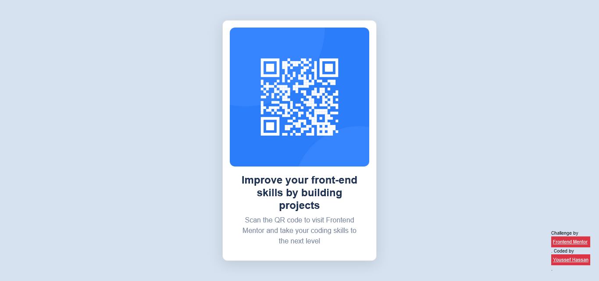

# Welcome! 👋

## Frontend Mentor - QR code component solution

This is a solution to the [QR code component challenge on Frontend Mentor](https://www.frontendmentor.io/challenges/qr-code-component-iux_sIO_H).

## Table of contents

- [Overview](#overview)
  - [Screenshot](#screenshot)
  - [Links](#links)
- [My process](#my-process)
  - [Built with](#built-with)
  - [What I learned](#what-i-learned)
  - [Useful resources](#useful-resources)
- [Author](#author)

## Overview

### Screenshot

### Links

- [live site](https://your-live-site-url.com)

## My process

### Built with

- Semantic HTML5 markup
- CSS3 custom properties
- Flexbox
- CSS Grid
- Mobile-first workflow
- [Bootstrap](https://getbootstrap.com/) - CSS & JS library

### What I learned

- Just improving my knowledge about bootstrap 5.

### Useful resources

- [Bootstrap Documentation](https://getbootstrap.com/docs/5.1/getting-started/introduction/) - This helped me for using the main classes.

## Author

- Website - **COMING SOON**
- [Linkedin](https://www.linkedin.com/in/joe-hsn/)
- [Telegram](https://t.me/Joe_Hsn)
- [Twitter](https://www.twitter.com/Jo_Hsn)
- [Frontend Mentor](https://www.frontendmentor.io/profile/Joe-Hsn)
